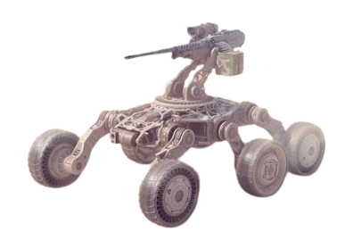

# DesignPCB-attackControl

# Controle remoto de ataque

Este projeto é um carrinho de controle remoto que possui um mecanismo de tiro integrado. O carrinho é controlado por um microcontrolador e utiliza uma placa de circuito impresso (PCB) personalizada para conectar todos os componentes eletrônicos necessários.

## Visão Geral

- **Microcontrolador**: Utiliza um microcontrolador Arduino Nano (ou equivalente) para controle geral.
- **Motorização**: Inclui motores DC para movimentação do carrinho.
- **Mecanismo de Tiro**: Um servomotor aciona um mecanismo de tiro.
- **Controle Remoto**: Comunicação via RF com um receptor e transmissor RF.
- **Componentes**: Sensores (opcionais), botões e LEDs para controle manual e feedback.

## Componentes Necessários

- **Microcontrolador**: Arduino Nano, ESP32 ou similar.
- **Driver de Motor**: L298N ou similar.
- **Motores DC**: Para movimentação do carrinho.
- **Servomotores**: Para o mecanismo de tiro.
- **Receptor RF e Transmissor RF**: Para controle remoto.
- **Sensores**: Opcional, para detectar obstáculos.
- **Fonte de Energia**: Baterias recarregáveis (Li-Po ou NiMH) e regulador de tensão.
- **Botões e LEDs**: Para controle manual e indicação de status.
- **Fios e Conectores**: Para conexões elétricas.

## Configuração do Projeto

### 1. Design da Placa de Circuito Impresso (PCB)

### 2. Montagem dos Componentes

1. **Preparar a Placa**: Receba e inspecione a placa de circuito impresso.
2. **Soldar Componentes**: Siga o layout da placa para soldar os componentes eletrônicos.
3. **Conectar Cabos e Fios**: Conecte motores, sensores e fontes de energia conforme o esquema.

## Instruções de Uso

1. **Ligar o Carrinho**: Conecte a fonte de energia e ligue o carrinho.
2. **Controle Remoto**: Utilize o controle remoto para movimentar o carrinho e acionar o mecanismo de tiro.
3. **Manutenção**: Realize verificações regulares e substitua componentes desgastados conforme necessário.

## Licença

Este projeto é licenciado sob a [Licença MIT](LICENSE).
